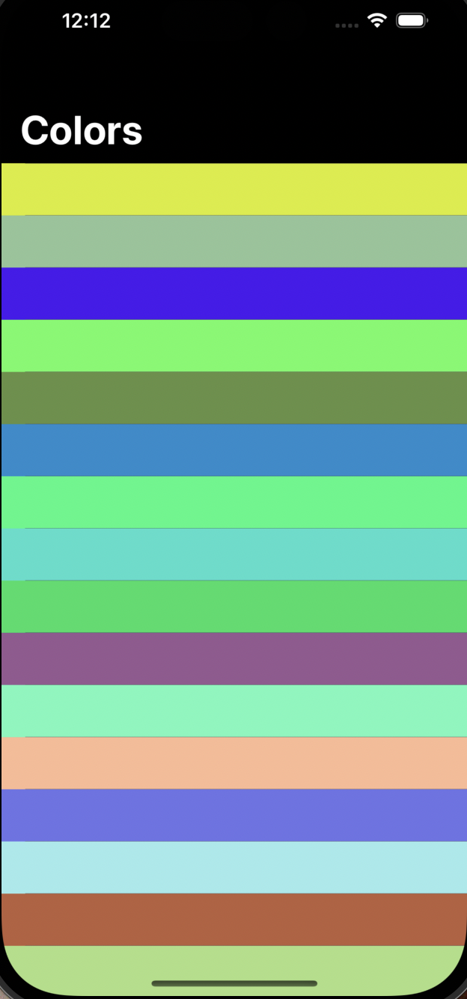
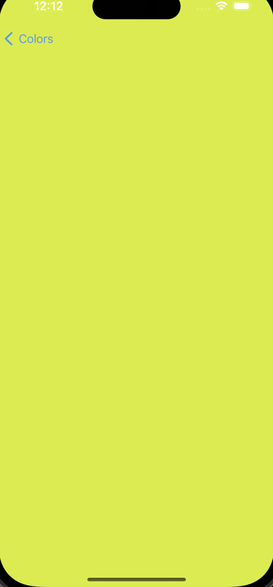

# Swift Random Colors

The app main purpose is to display some random color each time it opened.

## 🔧 Used resources

### UIKit Components:
- UIViewController
- NavigationController
- UITableView
- UITableViewDataSource
- UITableViewDelegate

## Images

  
  

## Developed with:

## 🔖 License

### Contact

Copyright © 2023 MrMindy

